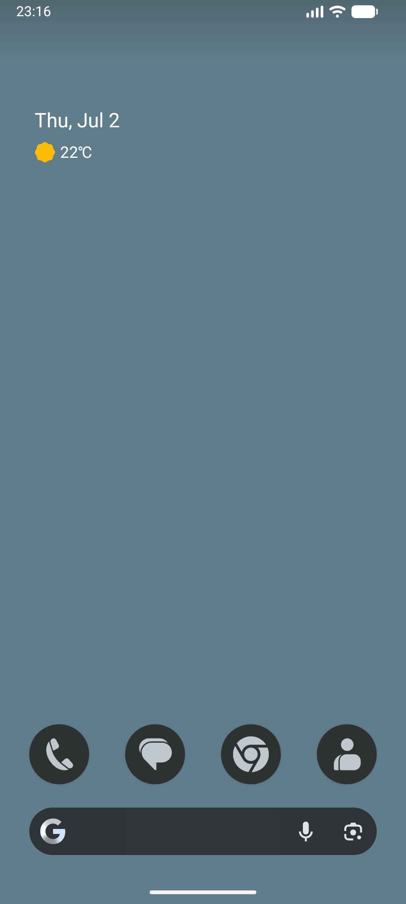
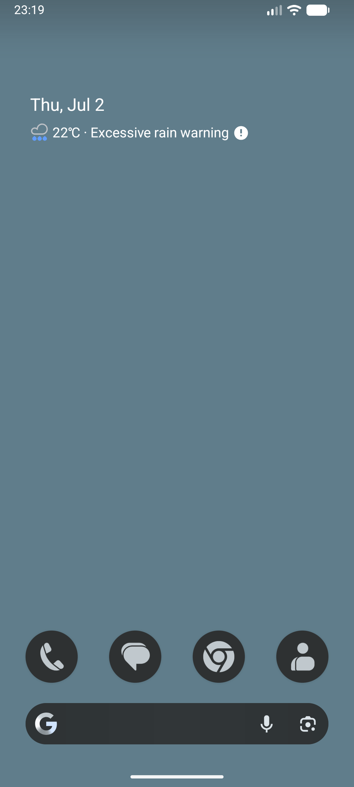
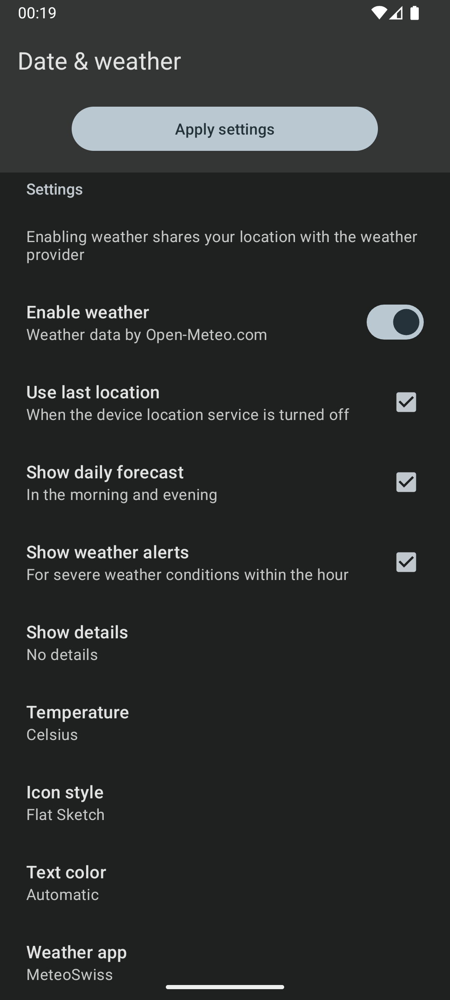

# Pimi Weather Widget

Pixel-style Android widget that shows the date and weather

## Features

* Displays date and weather for your current area
* Standalone widget, no launcher icon
* Tapping the widget opens your default weather app
* Lightweight and optimized for battery efficiency
* Location data is shared only with the weather provider
* No additional trackers, no ads, no Google Play dependencies

## Download

All download options provide the same APK file, signed with the same signing key.

## Screenshots

    
    
    

## Documentation

### Privacy Information

The widget collects your location approximately every 90 minutes. Your location data (latitude and longitude), along with your IP address, is shared with the weather provider ([Open-Meteo](https://open-meteo.com/)) to retrieve updated weather information. Only coarse location access is required; fine location access is optional. The last valid location information is stored on your device. You can view the data exchanged with the weather provider by tapping the **Build number** three times in the widget settings.

### Usage

This app does not provide a launcher icon. It is a widget-only application. To use it, add the widget to your home screen via the Android widget picker.

### Widget Configuration

Normally, your home app should allow you to reconfigure the widget (e.g., by long-pressing it). If your home app does not support widget reconfiguration, you can add a second Pimi Widget to the home screen to bring up the configuration window.

### Weather Display

The widget shows the weather forecast for the current hour. It refreshes every 30 minutes. The hourly forecast data for the next 6 hours is downloaded every 90 minutes. If the widget cannot update your location or retrieve new weather data for more than 6 hours (e.g., while in airplane mode), it will disable the weather display until both location and internet access are available again. If the internet is unavailable for an extended period, the widget may take up to 15 minutes to sync and display weather data.

### Location Access

In most cases, coarse location access is sufficient. For this to work, network-based location services must be enabled in your system settings (sometimes labeled as "Location Accuracy"). If only GPS-based location is available, fine location access must be granted to the widget.

### Weather and Calendar Apps

Tapping the date or weather area on the widget will open the default calendar or weather app, respectively, installed on your system. For weather apps to be compatible, they must include the `category.APP_WEATHER` intent in their manifest file.

Supported weather apps (among others): Google Weather, Breezy Weather.

### Weather Alerts

Severe and extreme weather alerts for the current hour are shown if the following conditions are met:

- **Severe UV warning:** UV index ≥ 8 (very high), according to [WHO](https://www.who.int/news-room/questions-and-answers/item/radiation-the-ultraviolet-(uv)-index)

- **Extreme UV warning:** UV index ≥ 11 (extreme), according to [WHO](https://www.who.int/news-room/questions-and-answers/item/radiation-the-ultraviolet-(uv)-index)

- **Excessive heat warning:** Apparent temperature ≥ 38°C (warning level 3), according to [DWD](https://www.dwd.de/DE/wetter/warnungen_aktuell/kriterien/warnkriterien.html)

- **Extreme heat warning:** Apparent temperature ≥ 43°C (dangerous heat), according to [NWS](https://www.weather.gov/ama/heatindex)

- **Excessive rain warning:** Rainfall ≥ 25 mm/h (warning level 3), according to [DWD](https://www.dwd.de/DE/wetter/warnungen_aktuell/kriterien/warnkriterien.html)

- **Extreme rain warning:** Rainfall ≥ 40 mm/h, according to [DWD](https://www.dwd.de/DE/wetter/warnungen_aktuell/kriterien/warnkriterien.html) (warning level 4)

- **Severe wind gust warning:** Wind gusts ≥ 105 km/h, according to [DWD](https://www.dwd.de/DE/wetter/warnungen_aktuell/kriterien/warnkriterien.html) (warning level 3)

- **Extreme wind gust warning:** Wind gusts ≥ 140 km/h, according to [DWD](https://www.dwd.de/DE/wetter/warnungen_aktuell/kriterien/warnkriterien.html) (warning level 4)

- **Severe thunderstorm warning:** Thunderstorms with severe rain or wind gusts, according to [DWD](https://www.dwd.de/DE/wetter/warnungen_aktuell/kriterien/warnkriterien.html) (warning level 3)

- **Extreme thunderstorm warning:** Thunderstorms with extreme rain or wind gusts, according to [DWD](https://www.dwd.de/DE/wetter/warnungen_aktuell/kriterien/warnkriterien.html) (warning level 4)

### Troubleshooting

You can find debug information by tapping the **Build number** three times in the widget settings and checking the **Last work status**. The following are the typical statuses and their meanings:

- **RecentDataServed:** The widget was updated with recent weather information. No new weather data needed to be downloaded.

- **FreshDataFetched:** The widget was updated with recent weather information. New weather data was successfully downloaded.

- **StaleDataServed:** The widget was unable to fetch new weather data for more than 90 minutes because the internet was unavailable. It will continue updating using the available forecast data until the internet becomes available again.

- **RecoveryEnqueued:** The widget was unable to fetch new weather data for more than 6 hours because the internet was unavailable. The weather display has been disabled. The background service has switched to recovery mode and will attempt to fetch new weather data as soon as the internet becomes available again.

- **InternetFailed:** The internet was unavailable during the recovery run. A new attempt is scheduled. Please ensure that your device is connected to the internet.

- **LocationUnavailableException:** The widget could not retrieve your location. A new attempt is scheduled. Please ensure that location services are enabled on your device. See the Location Access section above.

- **Other exceptions:** Most exceptions are likely related to network issues. The widget will continue updating using the available forecast data until the internet becomes available again.

## Donations

If you’d like to support meaningful work, consider donating to other projects such as:

* [GrapheneOS](https://grapheneos.org/donate/) – A secure and privacy-respecting Android-based OS
* [Qubes OS](https://www.qubes-os.org/donate/) – A security-focused desktop operating system
* [Open-Meteo](https://open-meteo.com/en/docs#donate) – A free and open weather API used by this app

## License & Copyright

This project is licensed under the GNU LGPL - see the LICENSE file for details. Weather icons and artwork created from scratch.