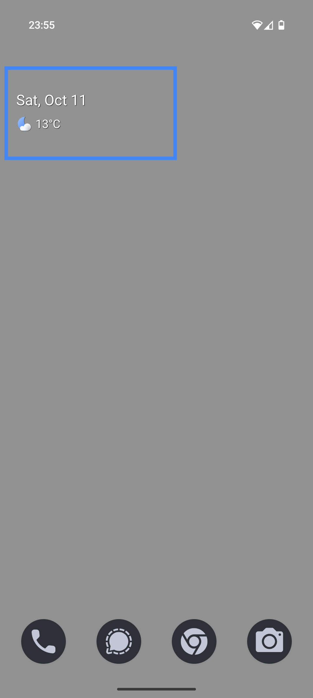
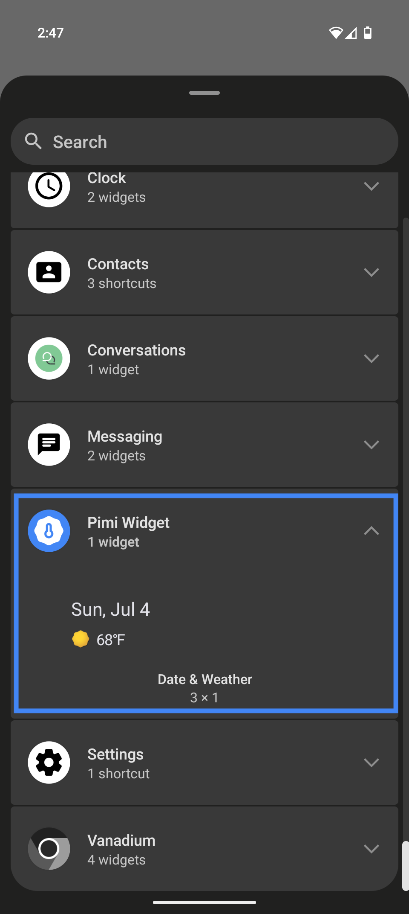
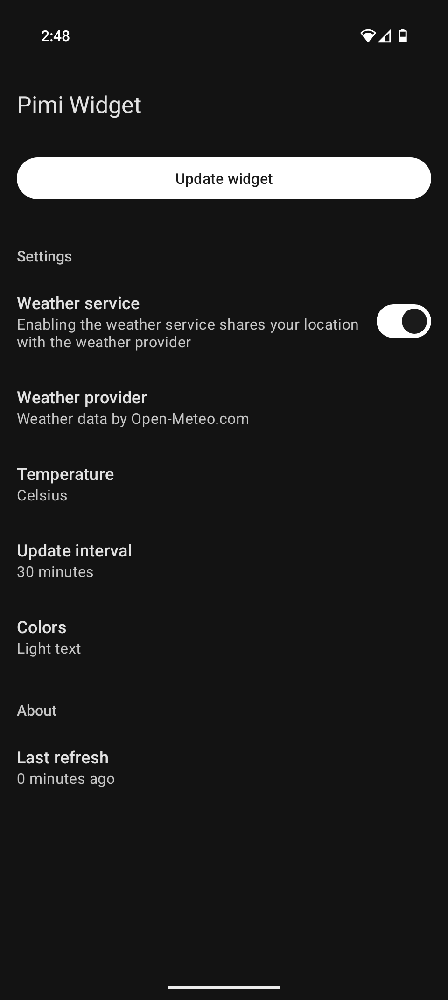

# Pimi Weather Widget

A minimal, Pixel-style Android widget that shows the date and weather.

## Features

* Displays date and weather for your current area
* Standalone widget, no launcher icon
* Tapping the widget opens your default weather app
* Lightweight and optimized for battery efficiency
* Location data is shared only with the weather provider (Open-Meteo)
* No additional trackers, no ads, no Google Play dependencies

## Download

## Screenshots

    
    
    

## Documentation

### Privacy Information

The widget collects your location approximately every 30 minutes. Your location data (latitude and longitude), along with your IP address, is shared with the weather provider to retrieve updated weather information. Only coarse location access is required; fine location access is optional. No location data is permanently stored on your device.

### Widget Configuration

Normally, your home app should allow you to reconfigure the widget (e.g., by long-pressing it). If your home app does not support widget reconfiguration, you can add a second Pimi Widget to the home screen to bring up the configuration window.

### Weather Display

The widget displays the hourly weather forecast. If it cannot access your location or retrieve weather data for more than 180 minutes (e.g., while in airplane mode), it will disable the weather display until both location and internet access are available again. After a device reboot or app update, it may take 2–3 minutes for the widget to sync and display weather data.

### Location Access

In most cases, coarse location access is sufficient. For this to work, network-based location services must be enabled in your system settings (sometimes labeled as "Location Accuracy"). If only GPS-based location is available, fine location access must be granted to the widget.

### Weather and Calendar Apps

Tapping the date or weather area on the widget will open the default calendar or weather app, respectively, installed on your system. For weather apps to be compatible, they must include the `category.APP_WEATHER` intent in their manifest file.

Supported weather apps (among others): Google Weather, Breezy Weather.

### Further Troubleshooting

If weather information does not appear, you can find debug information by tapping the **Data** field in the widget configuration. Try the following actions based on the displayed status:

- **Location FAILED**: The widget could not retrieve your location. Ensure that location services are enabled on your device. See the Location Access section above.

- **Location FAILED & Weather FAILED**: The widget failed to retrieve your location and thus, was not able to obtain weather data. Ensure that location services are enabled. Refer to the Location Access section above.

- **Location SUCCESS & Weather FAILED**: The widget retrieved your location but could not reach the weather provider. Ensure that your device is connected to the internet.

- **Worker ENQUEUED or RUNNING**: The background service for updating the widget is running correctly. If a different status appears, try re-enabling the weather service in the widget configuration.

## Donations

If you’d like to support meaningful work, consider donating to other projects such as:

* [GrapheneOS](https://grapheneos.org/donate/) – A secure and privacy-respecting Android-based OS
* [Qubes OS](https://www.qubes-os.org/donate/) – A security-focused desktop operating system
* [Open-Meteo](https://open-meteo.com/en/docs#donate) – A free and open weather API used by this app

## License & Copyright

This project is licensed under the GNU LGPL - see the LICENSE file for details. Weather icons and artwork created from scratch.