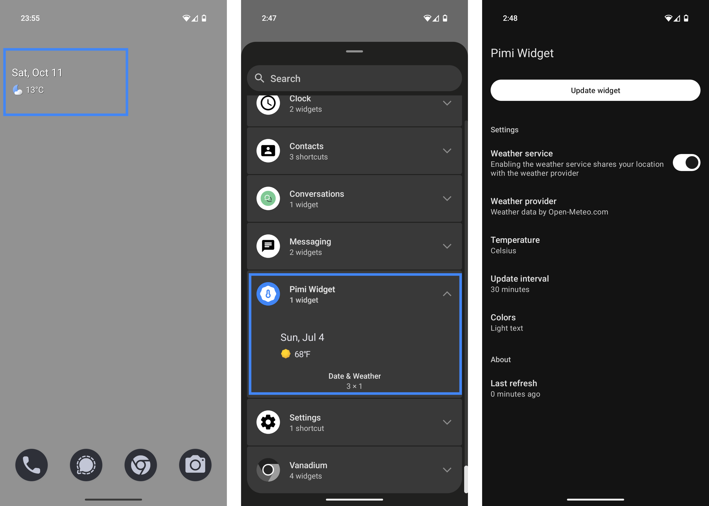

# Pimi Weather Widget

A minimal, Pixel-style Android widget that shows the date and weather.

## Features

* Displays date and weather for your current area
* Standalone widget, no launcher icon
* Tapping the widget opens your default weather app
* Lightweight and optimized for battery efficiency
* Location data is shared only with the weather provider (Open-Meteo)
* No ads, no trackers, no Google Play dependencies

## Screenshots

## FAQ

> **What data is collected, and who is it shared with?**

The widget collects your location approximately every 30 minutes. The location data (latitude and longitude), along with your IP address, is shared with the weather provider to retrieve updated weather information. Only coarse location access is required; fine location access is optional. No location data is permanently stored on your device.

> **Why doesn’t my weather app open when I tap the widget?**

Your weather app may not be recognized as a weather app by the Android operating system. To resolve this, the app developer should include the <code>category.APP_WEATHER</code> intent in the app’s manifest file. Supported weather apps (among others): Google Weather, Breezy Weather.

> **Why is no weather shown after a reboot or update?**

After a device reboot or app update, it may take 2–3 minutes for the widget to sync and display weather data.

> **Why did the weather information disappear from the widget?**

If the widget cannot access your location or retrieve weather data for more than 120 minutes (e.g., when in airplane mode), it disables the display of outdated weather information. Ensure that both internet connectivity and location services are enabled to restore functionality.

## Donations

If you’d like to support meaningful work, consider donating to other projects such as:

* [GrapheneOS](https://grapheneos.org/donate/) – A secure and privacy-respecting Android-based OS
* [Qubes OS](https://www.qubes-os.org/donate/) – A security-focused desktop operating system
* [Open-Meteo](https://open-meteo.com/en/docs#donate) – A free and open weather API used by this app

## License & Copyright

This project is licensed under the GNU LGPL - see the LICENSE file for details. Weather icons and artwork created from scratch.